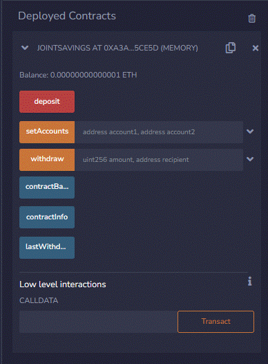

# FinTechM20Challenge
Module 20 Challenge Work

The steps for this Challenge are divided into the following sections:

* Create a Joint Savings Account Contract in Solidity
* Compile and Deploy Your Contract in the Remix IDE - Mainnet Fork VM
* Interact with Your Deployed Smart Contract

This work also demonstrates the requirements feature of smart contract
by establishing validations (e.g. withdraw amount should be greater than zero
, the address of the account that initiates withdraw should be one of the
test addresses 0x0c0669Cd5e60a6F4b8ce437E4a4A007093D368Cb or 
0x7A1f3dFAa0a4a19844B606CD6e91d693083B12c0 )

## Technologies
The challenge work uses Solidity programming language to deploy a 
smart contract on a Test virtual machine of Etherium Network

## Usage
To run the file, deploy the file on a test network and provide with
an initial ETH/Wei as a deposit amount

## Contributors
---
[Sreedhar](j_sreedhar@yahoo.com)

## License
---
MIT
